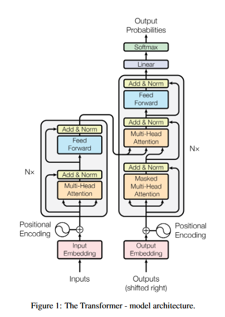

# Transformers From Scratch

Yet another repo that implements the Transformer Architecture From Scratch, using Pytorch only. 

We use "Attention Is All You Need" for reference.

Things to be implemented: 

~~1. Embedding Layers~~

~~2. Positional Encodings~~

~~3. Multi Head Attention~~

\t ~~a. Masking capability.~~

~~4. Layer Normalization~~

~~5. Skip Connections~~

~~6. Feed Forward Layers~~

7. Output Layers

~~8. Chain layers to create Encoder Blocks and Decoder Blocks~~

~~9. Chain Encoder Blocks to create Encoder and Decoder Blocks to create Decoder~~

10. Chain Encoder, Decoder, Embedding Layers and Projection Layers to create Transformer
